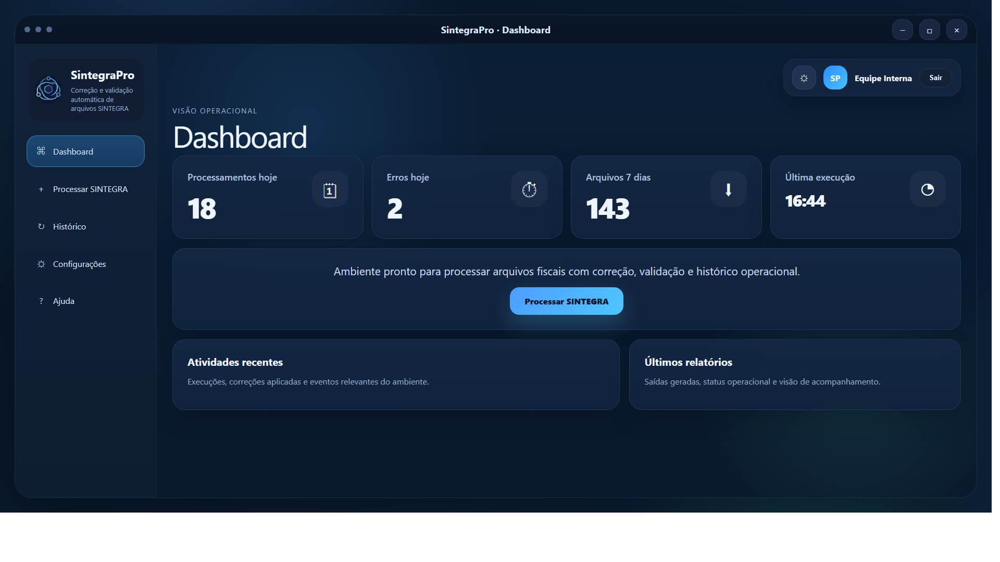
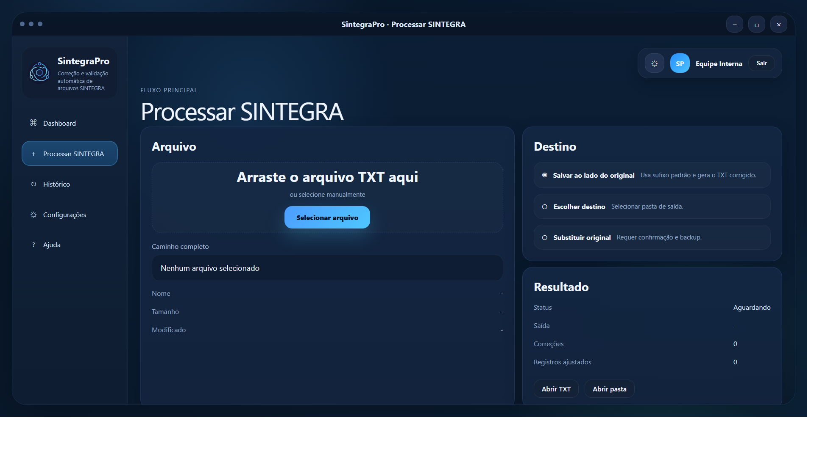
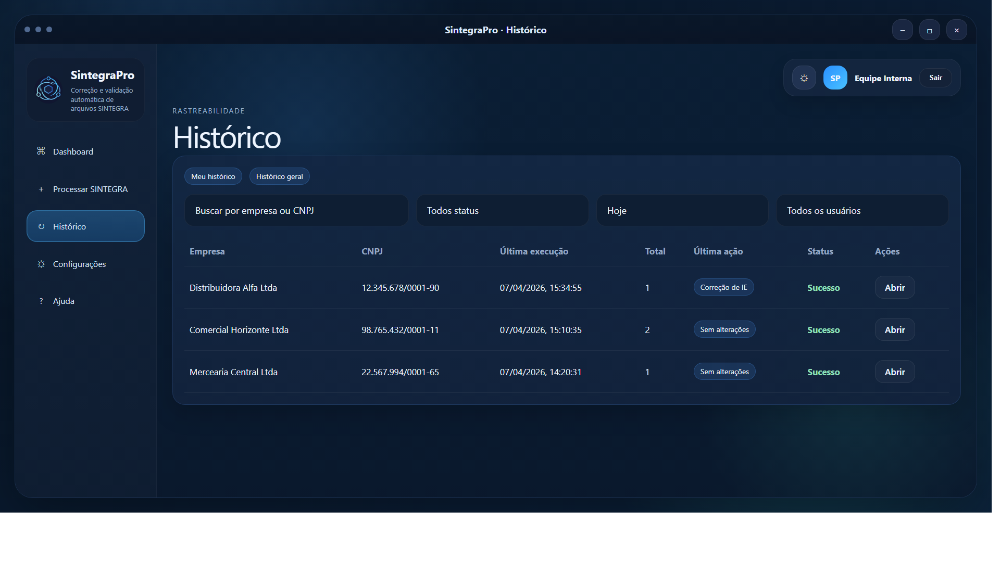
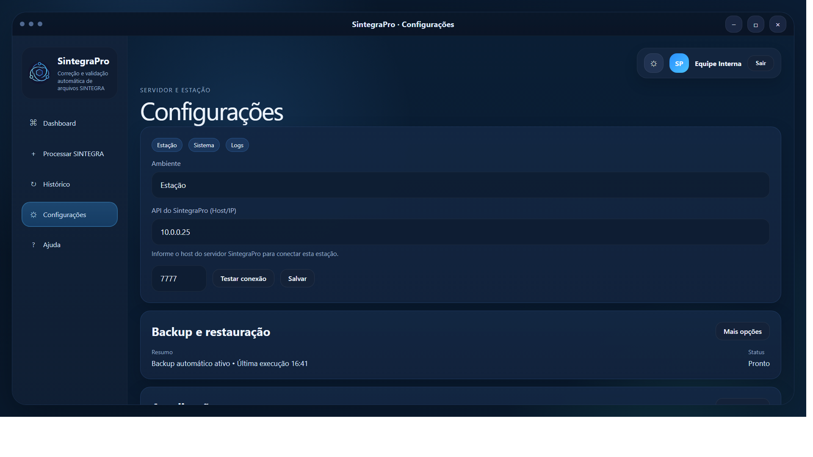
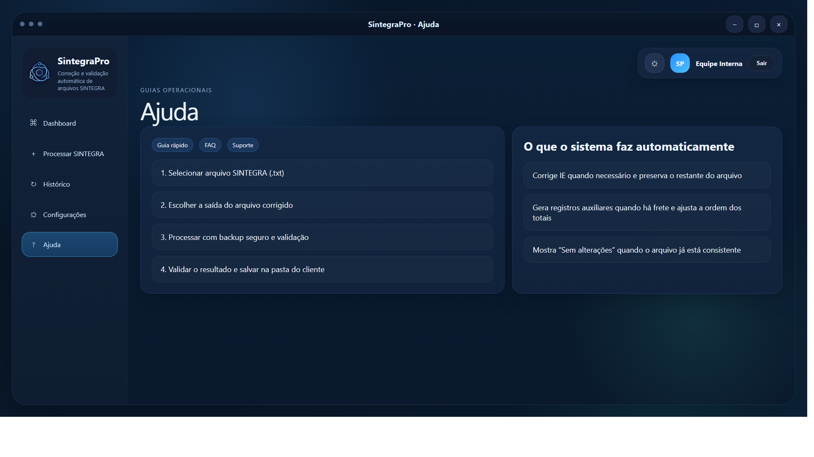

# SintegraPro Showcase


SintegraPro é um sistema desktop para **processamento, correção e validação de arquivos fiscais**, com foco em operação Windows, confiabilidade operacional e fluxo guiado para ambientes em **modo Servidor** e **modo Estação**.

Este repositório contém apenas a **vitrine técnica e visual** do projeto.  
O código-fonte completo, regras de negócio, integrações, scripts operacionais e artefatos internos permanecem em repositório privado.

## Visão geral

O produto foi desenhado para operação em rede local com dois papéis distintos:

- **Servidor**: hospeda API local, PostgreSQL, backup, restore e publicação de updates.
- **Estação**: processa arquivos localmente, sincroniza histórico com o servidor e recebe updates publicados.

## O que o sistema entrega

- processamento local de arquivos SINTEGRA
- correção e validação assistida
- histórico operacional com filtros e rastreabilidade
- configuração guiada por papel da máquina
- backup e restauração
- update distribuído em rede local
- instalador, updater e desinstalador visuais

## Galeria do produto

> Todas as imagens abaixo foram **sanitizadas ou reconstruídas para showcase**. Nenhuma mídia pública expõe dados reais de cliente, login, histórico operacional ou credenciais.

### Login


### Dashboard



### Processamento SINTEGRA



### Histórico operacional



### Configurações da estação



### Ajuda contextual



## Demonstrações rápidas

### Fluxo principal


### Configuração e ajuda


### Vídeo curto

- [Assistir demo em MP4](./assets/video-demo/sintegrapro-showcase.mp4)

## Arquitetura e documentação

- [Arquitetura](./docs/arquitetura.md)
- [Funcionalidades](./docs/funcionalidades.md)
- [Fluxo de telas](./docs/fluxo-de-telas.md)
- [Stack tecnológica](./docs/stack-tecnologica.md)

## Estrutura deste repositório

```text
SintegraPro-Showcase/
├─ README.md
├─ assets/
│  ├─ imagens/
│  ├─ gifs/
│  └─ video-demo/
├─ docs/
│  ├─ arquitetura.md
│  ├─ funcionalidades.md
│  ├─ fluxo-de-telas.md
│  └─ stack-tecnologica.md
└─ mock/
   └─ layout-estatico/
```

## Segurança e escopo

Este repositório **não** inclui:

- código-fonte completo
- integrações internas
- regras de negócio detalhadas
- banco de dados e migrations reais
- instaladores operacionais
- credenciais, chaves, tokens ou configurações sensíveis

## Status

- projeto em evolução contínua
- repositório público focado em apresentação técnica e portfólio
- implementação real mantida em repositório privado
